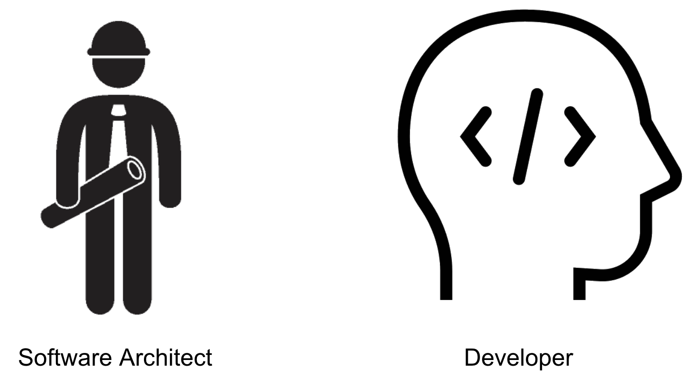
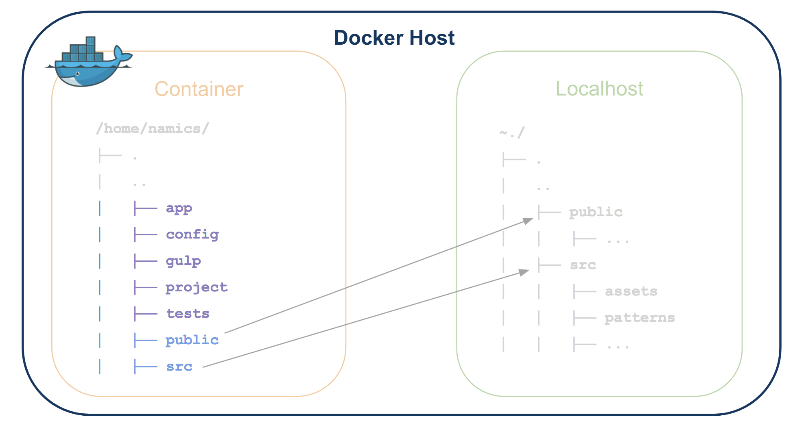

# Generator Nitro meets Docker
This Repository was created for a practical training in the Namics office located in Zurich. The main purpose of this project, is to outsource the nitro generator (https://github.com/namics/generator-nitro) to a Docker container. 

# Roles
Before we start to describe the purpose and all things about this project, it's important to describe the roles of this new working procedure.



## Architect
In my opinion the Software architect has the responsability to determine the technologies and to design the architecture of the Software. This means that the architect has the responsibility to create the Docker container for the project.

1. Generate the project with the yeoman nitro-generator.
2. Divide the the Nitro folders, from the sourcecode folders.
2.1 Copy the Nitro stuff into the ```nitro``` folder.
3. Give the developers the opportunity to work. E.g: Mount folders, etc.

## Developer
The Developer has only the responsability to watch on the sourcecode. The Developer do not worry about how the architecture was built. The most important thing is that, he / she knows the structure of the architecture and how to work with it. The developers binds the folder of the sourcecode with the folders in the docker container.

# Folder structure
This project has a special folder structure, which was created to optimize the work from the architect. 
```
project-folder/
├── .
│   ..
│   ├── nitro --> Nitro stuff
│   ├── project --> Sourcecode folder for the developers
│   ├── Docker-compose.yml --> Docker-compose file for run/build docker
│   ├── Dockerfile --> Dockerfile which describe the Docker image
```
How described in the previous section, the architect generates a project with the nitro-generator. This Nitro files are copied into the ```nitro``` folder and copied during buildtime within the docker-container.

# Docker Image
## Packages
The Docker Image is based on the latest Ubuntu and has the following packages installed: 
* curl
* npm
* git
* NodeJS 6.x
* yarn
* yeoman with generator-nitro

## Nitro Files
During Buildtime of the image, all needed files for nitro are copied into the container. This means that, when the developing System is started all needed files for the development are into it. It's not necessary to install any dependencies for the project or to run any commands like ```npm install```, because the container is shipped ready and prepared for the development.

## Package.json files
The package.json file into the nitro folder, should have a list with all dependencies of the project.

The package.json file into the ```project``` folder, should only include the run-scripts for the npm environment.

## Docker compose
To run a Docker container instance of this image, the docker-compose helper is used. What the developers needs for the project, are exposed ports and a special folder to mount the sourcecode directory in the developers local machine. 

## Folder mount


## Run the environment
To run the environemnt, the developer should onyl run the ```docker-comose up``` command. This runs a new instance of the docker image and starts all watchers and needed processes for the development. When a new container is started the command ```npm run dev``` as entrypoint is called. 

# Further Step
Next step of this project is to analyze how to integrate this environment into backend technologies, like AEM, magnolia, etc.
